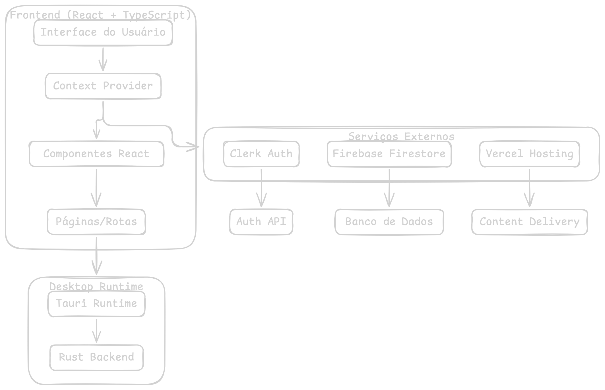
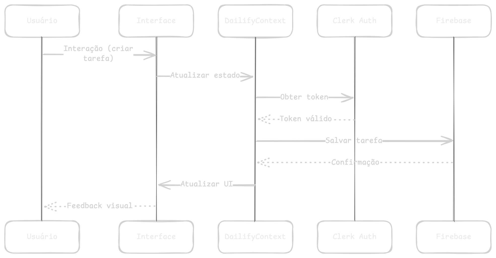
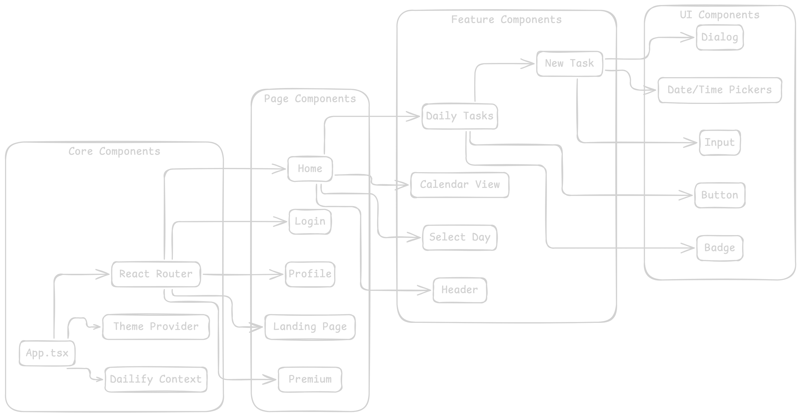
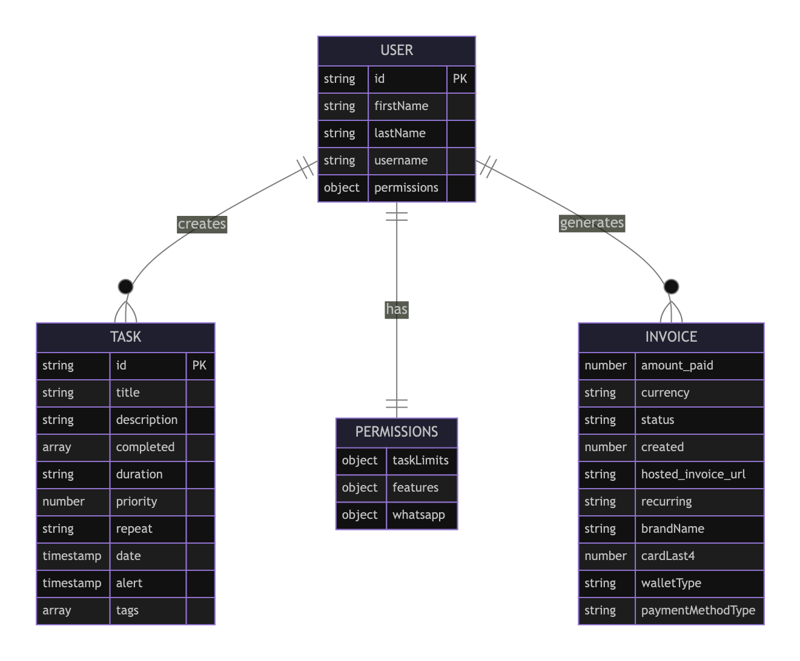
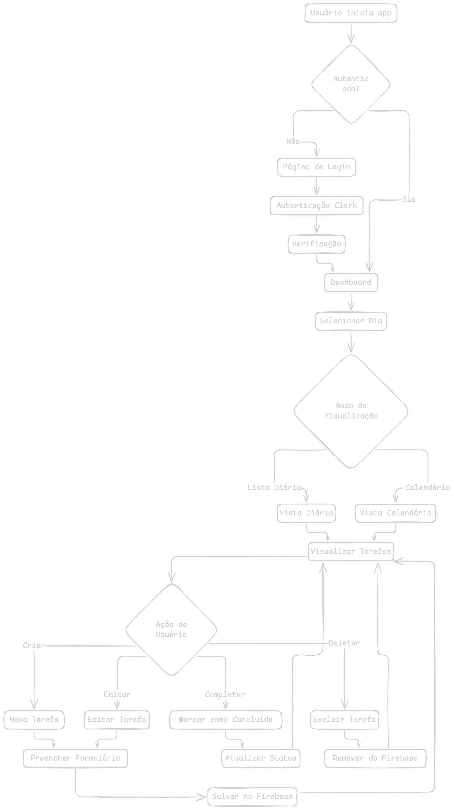

# Estudo de Caso: Dailify

## Visão Geral do Projeto

**Dailify** é uma aplicação moderna de gerenciamento de tarefas (task management) construída com tecnologias web contemporâneas. O projeto combina React/TypeScript para o frontend, Tauri para criação de aplicativo desktop multiplataforma, Firebase para backend e Clerk para autenticação.

### Informações Básicas
- **Nome:** Dailify
- **Versão:** 0.1.0
- **Tipo:** Aplicação Desktop/Web híbrida
- **Linguagem Principal:** TypeScript/React
- **Framework Desktop:** Tauri 2.0

## Arquitetura do Sistema

### Diagrama de Arquitetura Geral



### Diagrama de Fluxo de Dados



### Diagrama de Componentes



## Stack Tecnológico

### Frontend
- **React 18.3.1** - Biblioteca principal para UI
- **TypeScript 5.6.2** - Tipagem estática
- **Vite 6.0.3** - Build tool e dev server
- **React Router DOM 7.3.0** - Roteamento
- **Tailwind CSS 4.0.12** - Framework de estilização
- **Framer Motion 12.5.0** - Animações

### Desktop Runtime
- **Tauri 2.3.1** - Framework para aplicações desktop
- **Rust** - Backend nativo (via Tauri)

### Bibliotecas de UI/UX
- **Radix UI** - Componentes acessíveis primitivos
- **Lucide React** - Ícones
- **Sonner** - Notificações toast
- **React Day Picker** - Seleção de datas

### Serviços e Backend
- **Firebase 11.4.0** - Banco de dados (Firestore)
- **Clerk** - Autenticação e gestão de usuários
- **Vercel** - Hospedagem e deploy

### Ferramentas de Desenvolvimento
- **date-fns** - Manipulação de datas
- **nanoid** - Geração de IDs únicos
- **class-variance-authority** - Gerenciamento de variantes CSS

## Funcionalidades Principais

### 1. Gestão de Tarefas
- **Criação de tarefas** com título, descrição, data/hora
- **Configuração de duração** para cada tarefa
- **Sistema de prioridades** (0-3 níveis)
- **Tags personalizáveis** para categorização
- **Repetição** (Off, Daily, Monthly, Yearly, Weekly)
- **Marcação como concluída**
- **Exclusão de tarefas**

### 2. Visualização
- **Vista diária** com tarefas agrupadas por horário
- **Vista de calendário** para navegação mensal
- **Seleção de dia** interativa
- **Animações fluidas** com Framer Motion

### 3. Autenticação
- **Login via Clerk** com suporte a SSO
- **Verificação de conta**
- **Gestão de perfil de usuário**
- **Proteção de rotas**

### 4. Sistema Premium
- **Limitações de tarefas** para usuários gratuitos
- **Funcionalidades premium** (criação por voz, integração WhatsApp)
- **Sistema de cobrança** integrado

## Diagrama de Entidades



## Fluxo de Trabalho do Usuário



## Análise de Arquitetura

### Pontos Fortes

1. **Separação de Responsabilidades**
   - Context API bem estruturado para gerenciamento de estado
   - Componentes modulares e reutilizáveis
   - Tipagem TypeScript consistente

2. **Performance**
   - Vite para build rápido
   - Lazy loading de componentes
   - Animações otimizadas com Framer Motion

3. **Experiência do Usuário**
   - Interface responsiva com Tailwind CSS
   - Componentes acessíveis com Radix UI
   - Feedback visual imediato

4. **Escalabilidade**
   - Firebase Firestore para persistência
   - Tauri para aplicações desktop nativas
   - Arquitetura preparada para funcionalidades premium

### Áreas de Melhoria

1. **Gestão de Estado**
   - Considerar Redux Toolkit ou Zustand para estado mais complexo
   - Implementar cache local para offline-first

2. **Testes**
   - Adicionar testes unitários (Jest/Vitest)
   - Testes de integração para fluxos críticos
   - Testes E2E com Playwright

3. **Performance**
   - Implementar virtual scrolling para listas grandes
   - Code splitting mais granular
   - PWA para experiência web aprimorada

4. **Monitoramento**
   - Integração com Sentry para error tracking
   - Analytics de uso com Mixpanel/GA

## Casos de Uso Principais

### 1. Usuário Criando Nova Tarefa
```
Ator: Usuário autenticado
Pré-condições: Usuário logado no sistema
Fluxo:
1. Usuário clica no botão "+" para nova tarefa
2. Sistema abre modal de criação
3. Usuário preenche título, descrição, data/hora
4. Usuário define duração, prioridade, tags e repetição
5. Sistema valida dados e salva no Firebase
6. Sistema atualiza lista de tarefas e exibe confirmação
```

### 2. Visualização de Tarefas Diárias
```
Ator: Usuário autenticado
Pré-condições: Usuário possui tarefas cadastradas
Fluxo:
1. Usuário seleciona uma data específica
2. Sistema filtra tarefas para a data selecionada
3. Sistema agrupa tarefas por horário
4. Sistema exibe lista ordenada com animações
5. Usuário pode interagir com cada tarefa (editar/completar/excluir)
```

## Conclusão

O Dailify representa uma implementação moderna e bem estruturada de uma aplicação de gerenciamento de tarefas. A combinação de React/TypeScript para o frontend, Tauri para desktop e Firebase para backend cria uma solução robusta e escalável.

A arquitetura modular facilita manutenção e extensibilidade, enquanto as tecnologias escolhidas garantem performance e experiência do usuário de alta qualidade. O sistema de autenticação integrado e o modelo de negócio premium demonstram consideração para aspectos comerciais da aplicação.

### Métricas do Projeto
- **Linhas de Código:** ~3000+ (estimativa baseada na estrutura)
- **Componentes React:** 20+ componentes principais
- **Dependências:** 40+ packages npm
- **Plataformas Suportadas:** Web, Desktop (Windows, macOS, Linux)
- **Tempo de Build:** <30s (Vite + Tauri)